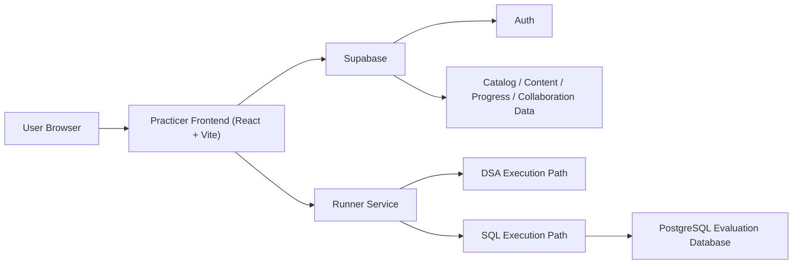

# Practicer Overview

## What Practicer Is
Practicer is a unified practice platform for:
- data structures and algorithms (DSA)
- SQL interview preparation

It combines a curated problem library, an in-browser workspace, personal progress tracking, and collaborative features in one application. The product is designed for focused, repeatable practice rather than passive problem browsing.

## What It Does
Practicer helps users:
- move through a structured roadmap tier by tier
- solve problems inside a dedicated workspace
- run and submit code or SQL queries against verified evaluators
- track progress across DSA and SQL separately
- keep notes, save versions, and revisit prior work
- collaborate through comments, shared notes, shared solutions, and notifications

The platform supports two study tracks:
- **DSA**: Python-based coding problems with test cases and submission history
- **SQL**: PostgreSQL-based query problems with standardized statements, schema views, sample data, output inspection, and hidden grading datasets

## Who It Is For
Practicer is designed for learners who want a structured technical interview workflow instead of a loose collection of questions.

Typical users include:
- software engineering candidates preparing DSA interview rounds
- data, analytics, and product candidates preparing SQL rounds
- learners who want one workspace for practice, revision, and comparison
- small study groups who want shared notes, comments, and progress visibility

## Core Product Features

### 1. Curated problem library
- `300` DSA problems
- `148` SQL problems
- problems organized by tier, phase, and study order
- source-aware problem metadata and outbound source links
- filters for difficulty, status, phase, company, and source

### 1.1 Dataset and curation
Practicer does not treat the library as a raw scraped dump. The problem set is curated and normalized before it is shown in the workspace.

That curation includes:
- source resolution and source-link cleanup
- structured presentation data for problem statements, examples, schema, and requirements
- verified SQL grading datasets and hidden checks
- normalized DSA and SQL problem content so the workspace feels consistent instead of source-dependent

### 1.2 Test case and grading curation
Practicer also curates how problems are evaluated, not just how they are displayed.

That includes:
- verified DSA test case coverage for visible runs and graded submissions
- curated SQL sample datasets for exploration in the workspace
- broader hidden SQL grading datasets for submission correctness
- normalization of expected outputs, edge cases, and grading behavior
- separation between user-facing sample data and backend-only hidden evaluation data

The goal is to make the platform trustworthy in two ways:
- the problem statement and structure are clean for learning
- the evaluator still checks more than a toy sample input

The library is intentionally split into two tracks:
- **DSA (`300`)** for core coding interview preparation
- **SQL (`148`)** for analytics, product, and data interview preparation

### 1.3 Tiering system
Practicer uses a tier-first study model.

Each track is divided into:
- **Tier 1**: highest-priority coverage across the roadmap
- **Tier 2**: broader problem depth after the essentials
- **Tier 3**: harder or more specialized follow-up practice

The platform’s navigation and resume logic are designed around completing one tier before moving deeper.

### 1.4 Phase system
Within each tier, problems are further organized by phase.

Phases group problems by pattern or topic, for example:
- DSA pattern groups
- SQL topic groups such as joins, time-series, gaps and islands, retention, or window functions

This gives the library two layers of structure:
- **Tier** answers: what should be prioritized first
- **Phase** answers: what pattern or topic the problem belongs to

That combination is what drives:
- sorting
- resume flow
- next-problem navigation
- dashboard progress views

### 2. Structured study flow
- tier-first navigation and resume logic
- next problem progression aligned with the study roadmap
- separate DSA and SQL modes with persisted preferred mode
- dashboard metrics scoped to the active track

### 2.1 Personalization and study controls
Practicer includes lightweight personalization so the workspace stays aligned with how each user studies.

That includes:
- persisted preferred mode (`DSA` or `SQL`)
- personal vs comparison dashboard view
- track-aware resume behavior
- current-user specific notes, solutions, resources, and progress

### 3. Dedicated problem workspace
- left pane for problem content and study materials
- center editor for code or SQL writing
- bottom analysis pane for results and history
- SQL-specific data and output workflow
- DSA-specific test case and case analysis workflow

### 4. Verified execution paths
- DSA execution through the runner backend and evaluator flow
- SQL execution against PostgreSQL with isolated grading datasets
- hidden grading retained for correctness, while user-facing SQL runs use sample data for exploration

### 4.1 Assessment model
Practicer separates exploration from grading.

For DSA:
- users run solutions against visible test cases
- submissions go through the evaluator and update solved progress

For SQL:
- users run queries against visible sample data in the workspace
- submissions are graded against broader hidden datasets
- hidden SQL grading remains stricter than the user-facing sample view

This keeps the workspace intuitive while still preserving real evaluation depth.

### 5. Progress and persistence
- solved status and progress reconciliation
- saved solution versions
- notes and resources per problem
- submission history and prior run inspection
- persistent active track and dashboard preferences

### 6. Collaboration features
- problem comments
- shared notes
- shared solutions
- realtime notifications for collaboration and progress events
- multi-user comparison mode with opt-in personal-only view

### 6.1 Roles and operation model
Practicer is built around two practical user roles:
- **learner**: solves problems, keeps notes, saves solutions, and reviews progress
- **admin/curator**: manages problems, content, fixtures, and structured presentation data

This matters because the product is not only a learner-facing UI. It also includes the curation layer required to keep the dataset clean and the evaluator trustworthy.

### 7. Admin and curation tools
- admin workflows for managing problems and content
- SQL problem specs and fixtures
- canonical content model using structured presentation data
- migration-backed schema evolution for DSA + SQL support

## SQL Experience
Practicer’s SQL track is intentionally different from its DSA track.

Users can:
- read standardized SQL problem statements
- inspect schema tables and sample data
- run queries against sample datasets
- review query output in real tables
- submit against hidden grading datasets

Internally, SQL grading still uses broad coverage and multiple hidden datasets, but the visible workspace is simplified so users focus on the sample data and output they actually need.

## DSA Experience
Practicer’s DSA track focuses on coding workflow:
- read the problem statement and examples
- write Python solutions in the workspace
- run code against visible test cases
- submit against the evaluator
- review results, history, notes, and saved versions

## Product Principles
Practicer is built around a few clear principles:
- **structured practice over endless browsing**
- **clarity over clutter**
- **verified data over scraped inconsistency**
- **one product for DSA and SQL, not two disconnected tools**
- **serious study tooling without unnecessary UI noise**

## What Makes It Different
Practicer is not just a themed problem list.

Its core differentiators are:
- curated tier-and-phase study flow instead of flat browsing
- verified SQL and DSA evaluation paths instead of presentation-only content
- one unified product for coding and SQL practice
- structured problem presentation instead of raw mixed-source scraping
- collaboration features built directly into the practice workflow
- an admin/curation layer that keeps the library and evaluator aligned over time

## High-Level Architecture
Practicer is composed of:
- **Frontend**: React + Vite
- **Backend data/auth**: Supabase
- **Runner**: separate execution service for DSA and SQL evaluation
- **Deployment**:
  - frontend on Netlify
  - runner on its own backend host

### Architecture Flow

The practical split is:
- the frontend owns product UI, navigation, and user workflow
- Supabase owns application data and authentication
- the runner owns execution and grading
- DSA and SQL share one product shell, but use different evaluation paths under the hood

## Deployment Footprint
Current deployment model:
- **Frontend**: Netlify
- **Frontend domain**: `practicer.czarflix.me`
- **Runner**: separate backend host
- **Runner domain**: `runner.czarflix.me`
- **Database/Auth**: Supabase

This split keeps the product simple operationally:
- static frontend deploys stay fast
- the runner can stay stateful and execution-focused
- SQL and DSA evaluation remain isolated from the main app hosting layer

## Main Product Surfaces
Practicer’s user-facing experience is built around a few core surfaces:

- **Login**
  - lightweight product entry with identity-based access
- **Dashboard**
  - active-track view of progress, solved counts, review queue, and recent work
- **Problems List**
  - curated library browsing with filtering by source, difficulty, company, status, phase, and tier
- **Problem Workspace**
  - primary solving surface for both DSA and SQL
- **Settings**
  - mode preferences, comparison view, and user-facing controls
- **Admin**
  - curation and maintenance surface for structured problem/content management

These surfaces work together as one workflow rather than separate disconnected tools.

## Typical User Flow
1. Open Practicer.
2. Choose or resume the active study track.
3. Continue from the next problem in the current tier.
4. Solve in the workspace.
5. Run or submit.
6. Review results.
7. Save notes, versions, or revisit later.

## Current Scope
Practicer is already built to support both DSA and SQL inside one consistent application. The product now includes:
- unified track-aware navigation
- standardized SQL presentation and workspace flow
- rewritten, cleaner DSA and SQL problem content
- verified local and live grading support
- production-ready deployment split between frontend and runner

## Future Surface Extensions
The current product overview covers the live core. Natural future extensions include:
- richer analytics on progress over time
- broader admin-side curation tooling
- additional workspace polish and motion refinement
- deeper collaboration workflows for shared study sessions

These are extensions to the existing product, not a change in direction. The current foundation already supports a serious end-to-end practice workflow.
