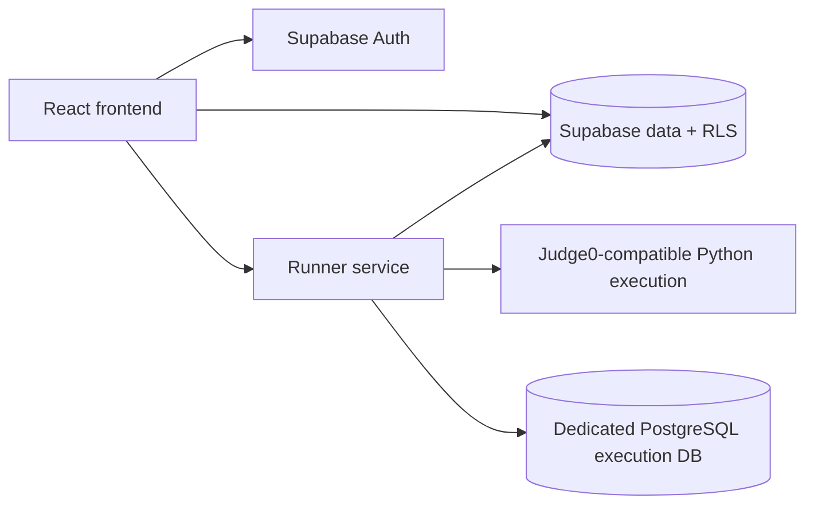

# Practicer overview

## What it is

Practicer is a React and Supabase engineering prototype for structured DSA and SQL interview practice. The repository contains a study UI, migration-backed data model, curation/admin surfaces, and a separate runner service for Python and PostgreSQL exercises.

The source supports two tracks:

- DSA practice with Python submissions, saved work, and test-case history.
- SQL practice with schema/sample views and fixture-based query or script evaluation.

## Source-backed product surfaces

- Tier- and phase-oriented problem navigation.
- Separate DSA and SQL workspace states.
- Notes, saved solutions, progress, comments, shared notes, and notifications.
- Admin flows for problem content and fixture curation.
- Supabase migrations for application tables and row-level policies.
- A runner service that delegates Python to a Judge0-compatible endpoint and executes SQL in a dedicated PostgreSQL database.

These are implementation claims about the checked-in source. They are not claims about user counts, production traffic, evaluator accuracy, or current hosted-service availability.

## Corpus evidence

The repository does not currently contain the complete DSA or SQL corpus payloads needed to reproduce a numeric problem count:

- The DSA catalog migration derives rows from pre-existing database state.
- The SQL migration defines corpus tables, while the runner's local fallback points to an out-of-repository generated artifact.

The deterministic [machine-readable corpus report](./docs/corpus-count.json) therefore records both totals as `null` and marks `300 DSA + 148 SQL` unsupported by the current tracked tree. Numeric corpus claims should remain out of portfolio and resume copy until tracked data reproduces them.

## Execution model

### DSA

The runner builds a Python harness and delegates execution to a configured Judge0-compatible service with CPU, wall-time, memory, file-size, and test-count limits. The repository does not independently prove the provider's operating-system, filesystem, or network isolation.

### SQL

Each SQL fixture runs inside a transaction and a random schema. The runner sets statement and lock timeouts, applies a conservative control-plane denylist, compares normalized results, and rolls the transaction back. Controlled DML remains available for script exercises.

Hidden SQL fixtures have two checked-in disclosure boundaries:

- ordinary authenticated Supabase reads are limited to rows with `is_public = true` by the latest migration;
- runner result records replace hidden fixture metadata and data with an opaque check identifier and pass/fail state.

These controls are covered by local behavioral tests. Applying the migration and validating least-privilege database roles in a real environment remain deployment obligations.

## Architecture

The frontend owns the study workflow, Supabase owns application data/authentication, and the runner owns execution and evaluation orchestration.

## Verified local checks

- Root and runner lockfiles support `npm ci`.
- Frontend lint and build are CI gates.
- Runner syntax and behavioral tests are CI gates.
- The corpus report is regenerated deterministically and checked for drift in CI.

The runner tests cover policy and orchestration behavior with isolated fakes; they do not replace an end-to-end test against Supabase, Judge0, and PostgreSQL.

## Deployment status

- Frontend provider URL: [practice-czarflix.netlify.app](https://practice-czarflix.netlify.app/) (HTTP 200 on 2026-07-23).
- Custom frontend domain: unresolved during the same check.
- Documented runner hostname: unresolved during the same check.
- Live grading: unverified; the public frontend should be treated as a demo until the health and execution paths pass an external smoke test.

Repository metadata already provides a React/Supabase description and the topics `react`, `security`, `sql`, and `supabase`. The GitHub homepage field is still empty and requires an external metadata update after choosing the provider URL.

## Security and dependency posture

The runner is defense in depth, not an independently audited arbitrary-code sandbox. Deployment owners remain responsible for least-privilege credentials, network isolation, rate limits, egress controls, provider logging, and migration application.

On 2026-07-23, both local npm audits on this repair branch reported zero vulnerabilities, and its lockfile resolves `dompurify@3.4.12` for Monaco and jsPDF dependency paths. GitHub still reported three open `dompurify` alerts (one medium and two low) because the public default-branch lockfile contains a nested older entry. The project does not claim zero GitHub alerts until the corrected lockfile is merged and the remote alerts clear.

## Safe portfolio framing

Practicer is safe to describe as a substantial interview-practice prototype with a React/Supabase frontend, a separate execution service, migration-backed data boundaries, and locally tested SQL-runner controls. Do not describe it as production-grade, as a secure sandbox, as a verified live grader, or as a 448-problem corpus until the missing deployment and tracked-data evidence exists.
