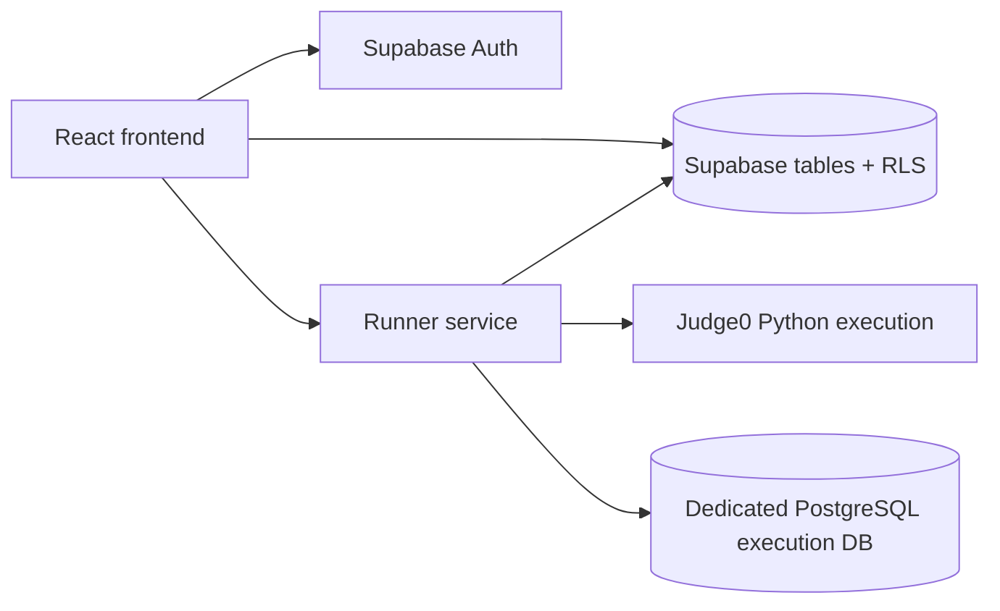

# Practicer

## Product

Website overview and feature summary live in [PRODUCT_OVERVIEW.md](./PRODUCT_OVERVIEW.md).

Unified React + Supabase workspace for DSA and SQL practice, with a separate runner backend for code execution.

## App Setup

```bash
npm install
npm run dev
```

## Required Frontend Env (`.env.local`)

```bash
VITE_SUPABASE_URL=...
VITE_SUPABASE_ANON_KEY=...
VITE_RUNNER_API_URL=http://localhost:8787
```

## Data Import Scripts

```bash
npm run import:problems
npm run import:sql
npm run import:sql-presentation
```

## Problem Visuals

```bash
npm run build:problem-visual-manifest
npm run validate:problem-visuals
npm run generate:problem-visuals-local -- --problem-key=dsa-leetcode-11
npm run sync:problem-visuals -- --mode=ingest --manifest=out/problem-visuals-manifest.json
npm run sync:problem-visuals -- --mode=generate --problem-key=dsa-leetcode-11
```

`sync:problem-visuals` enforces `gemini-3-pro-image-preview` as the only allowed model and fails the row instead of falling back.

## Architecture and status

Practicer is a React + Supabase learning application with a separate runner service. The frontend owns the study experience and user-scoped state; Supabase migrations define row-level policies; the runner evaluates Python and SQL submissions against fixtures; and the admin surface manages the problem corpus.



The project is an active engineering prototype with a working local/deployment workflow. It is not described as a secure arbitrary-code sandbox or production-grade execution environment.

## Execution model and security boundaries

- Python submissions are sent to the configured Judge0-compatible service with configured CPU, wall-time, memory, file-size, and test-count limits. The repository does not independently prove the provider's OS, filesystem, or network isolation.
- SQL fixtures run in a dedicated PostgreSQL connection, a random per-run schema, and a transaction that is rolled back. A statement and lock timeout plus a small control-plane denylist are applied before execution.
- SQL is not a read-only role: script exercises require controlled DML. `CREATE EXTENSION`, `COPY` transport/file operations, role changes, privilege changes, `DO`, `VACUUM`, and related control-plane operations are blocked, but deployment owners must still enforce a least-privilege database role and network isolation.
- Hidden tests are loaded by the runner service and should not be sent to the browser. A deployment must verify that logs, error payloads, and database access do not disclose hidden fixtures.
- Supabase row-level security is defined in `supabase/migrations/`; apply and test those migrations in the target project before making user-isolation claims.

## Evaluation

Visible and hidden fixtures are compared using deterministic result normalization. Run the repository smoke and validation scripts after provisioning the required Supabase and execution-database services. No coverage percentage, problem count, user count, or production-usage claim is made here unless it is accompanied by a checked-in measurement.

## Known limitations

- The runner is not a substitute for an independently audited sandbox.
- Provider credentials, database roles, network egress, rate limiting, and log retention are deployment responsibilities.
- SQL parsing/allowlisting is intentionally conservative and should be expanded with a real parser and adversarial tests before exposing the service broadly.
- The public repository includes deployment instructions but does not itself prove the current hosted deployment state.

Local-first review flow:

```bash
npm run generate:problem-visuals-local -- --limit=5
npm run validate:problem-visuals -- --manifest=out/problem-visuals-generated/problem-visuals-local-manifest.json --require-files --allow-partial
npm run sync:problem-visuals -- --mode=ingest --manifest=out/problem-visuals-generated/problem-visuals-local-manifest.json
```

If `GOOGLE_CLOUD_PROJECT` is unset, local generation falls back to your active `gcloud` project. If ADC is broken, it falls back to `gcloud auth print-access-token`.

## Runner Service

Runner backend is in [runner-service](./runner-service/README.md).

```bash
npm --prefix runner-service install
npm run runner:dev
```

## Deployment

Deployment scripts and infra notes live under [deploy](./deploy/README.md).
