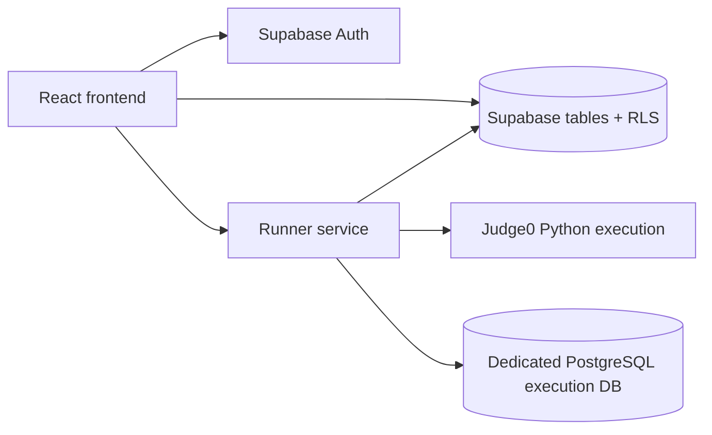

# Practicer

## Product

Website overview and feature summary live in [PRODUCT_OVERVIEW.md](./PRODUCT_OVERVIEW.md).

Unified React + Supabase workspace for DSA and SQL practice, with a separate runner backend for code execution.

## App Setup

```bash
npm ci
npm run dev
```

## Required Frontend Env (`.env.local`)

```bash
VITE_SUPABASE_URL=...
VITE_SUPABASE_ANON_KEY=...
VITE_RUNNER_API_URL=http://localhost:8787
```

## Data Import Scripts

```bash
npm run import:problems
npm run import:sql
npm run import:sql-presentation
```

## Problem Visuals

```bash
npm run build:problem-visual-manifest
npm run validate:problem-visuals
npm run generate:problem-visuals-local -- --problem-key=dsa-leetcode-11
npm run sync:problem-visuals -- --mode=ingest --manifest=out/problem-visuals-manifest.json
npm run sync:problem-visuals -- --mode=generate --problem-key=dsa-leetcode-11
```

`sync:problem-visuals` enforces `gemini-3-pro-image-preview` as the only allowed model and fails the row instead of falling back.

## Architecture and status

Practicer is a React + Supabase learning application with a separate runner service. The frontend owns the study experience and user-scoped state; Supabase migrations define row-level policies; the runner evaluates Python and SQL submissions against fixtures; and the admin surface manages the problem corpus.



The project is an active engineering prototype with a reproducible frontend build and a separately deployable runner. It is not described as a secure arbitrary-code sandbox or production-grade execution environment. The public frontend is currently a demo surface: the provider URL is reachable, but live grading remains unverified because the documented runner hostname does not resolve.

## Execution model and security boundaries

- Python submissions are sent to the configured Judge0-compatible service with configured CPU, wall-time, memory, file-size, and test-count limits. The repository does not independently prove the provider's OS, filesystem, or network isolation.
- SQL fixtures run in a dedicated PostgreSQL connection, a random per-run schema, and a transaction that is rolled back. A statement and lock timeout plus a small control-plane denylist are applied before execution.
- SQL is not a read-only role: script exercises require controlled DML. `CREATE EXTENSION`, `COPY` transport/file operations, role changes, privilege changes, `DO`, `VACUUM`, and related control-plane operations are blocked, but deployment owners must still enforce a least-privilege database role and network isolation.
- Hidden SQL tests are loaded by the service-role runner. The checked-in RLS migration limits ordinary authenticated fixture reads to `is_public = true`, and runner results redact hidden fixture identifiers, labels, expected rows, output rows, and raw database errors. Apply and integration-test the migration in the target Supabase project before relying on that boundary.
- Supabase row-level security is defined in `supabase/migrations/`; apply and test those migrations in the target project before making user-isolation claims.

## Evaluation

Visible and hidden fixtures are compared using deterministic result normalization. Local behavioral tests cover control-plane rejection, statement-size limits, timeout setup, random-schema isolation, rollback, hidden-fixture redaction, and public sample preservation. End-to-end execution still requires provisioned Supabase, Judge0, and PostgreSQL services.

The machine-readable [corpus report](./docs/corpus-count.json) currently marks DSA and SQL totals as unverified because the tracked migrations depend on pre-existing database rows and the corpus payloads are not checked in. Do not use `300 DSA + 148 SQL` as a public claim from this repository state.

## Known limitations

- The runner is not a substitute for an independently audited sandbox.
- Provider credentials, database roles, network egress, rate limiting, and log retention are deployment responsibilities.
- SQL parsing/allowlisting is intentionally conservative and should be expanded with a real parser and adversarial tests before exposing the service broadly.
- The public repository includes deployment instructions but does not itself prove the current hosted deployment state.

## Dependency security status

Recorded verification on 2026-07-24:

- `npm audit` at the repository root: 0 vulnerabilities.
- `npm --prefix runner-service audit`: 0 vulnerabilities.
- The checked-in lockfile resolves `dompurify@3.4.12` for both Monaco and jsPDF dependency paths.
- An authenticated GitHub Dependabot query reported 0 open alerts.

These are point-in-time audit results, not a standing guarantee. Before publishing or updating dependency-security claims, re-run both audits, verify the lockfile-resolved versions, and query the current GitHub Dependabot alerts.

Local-first review flow:

```bash
npm run generate:problem-visuals-local -- --limit=5
npm run validate:problem-visuals -- --manifest=out/problem-visuals-generated/problem-visuals-local-manifest.json --require-files --allow-partial
npm run sync:problem-visuals -- --mode=ingest --manifest=out/problem-visuals-generated/problem-visuals-local-manifest.json
```

## Runner Service

Runner backend is in [runner-service](./runner-service/README.md).

```bash
npm --prefix runner-service ci
npm --prefix runner-service test
npm run runner:dev
```

## Deployment

The verified frontend provider URL is [practice-czarflix.netlify.app](https://practice-czarflix.netlify.app/). The custom frontend and runner domains did not resolve during the 2026-07-23 check, so they are not advertised as working endpoints. Deployment manifests live under [deploy](./deploy/).
